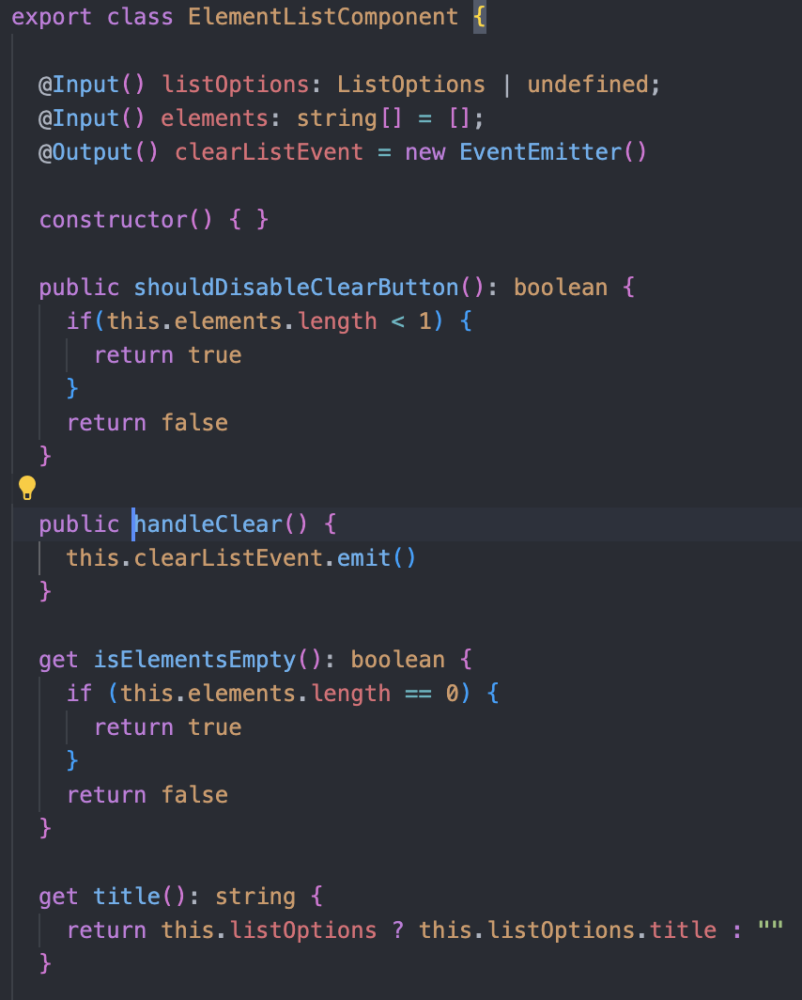
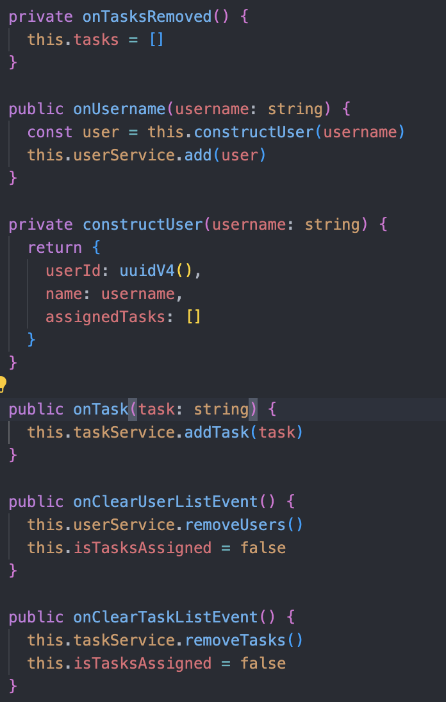
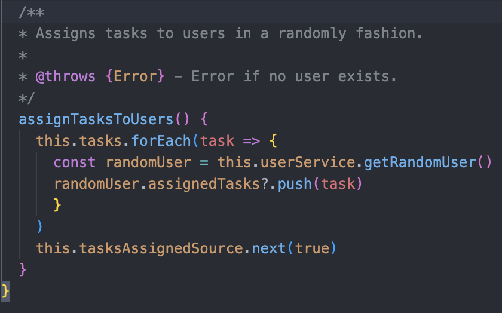
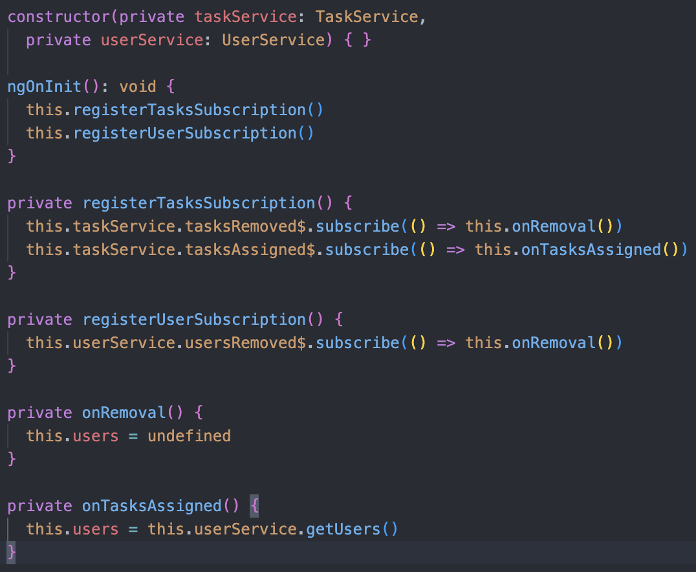
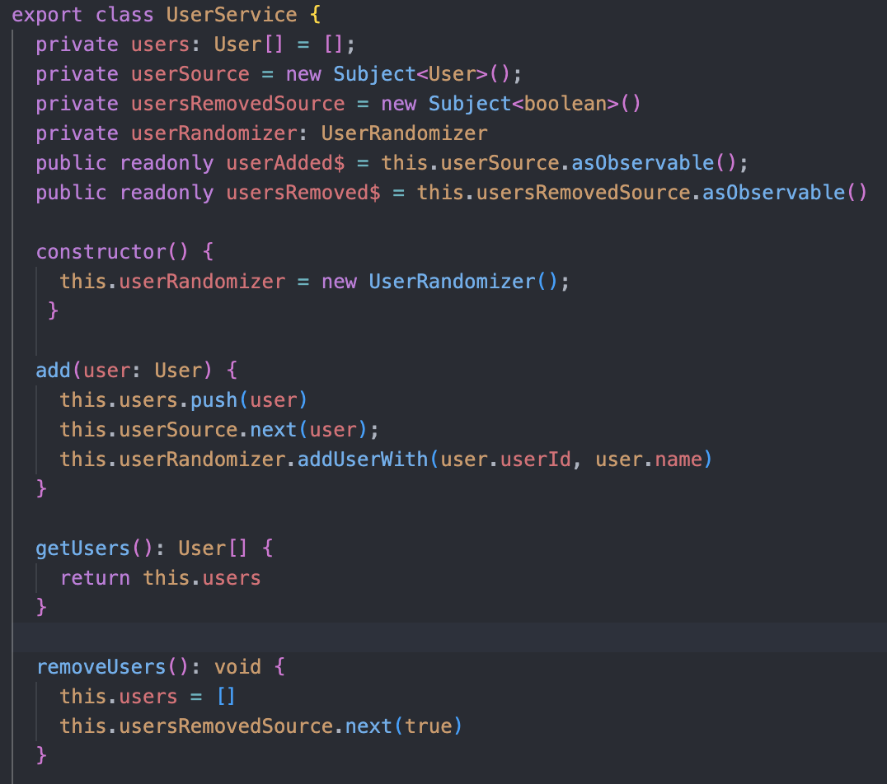
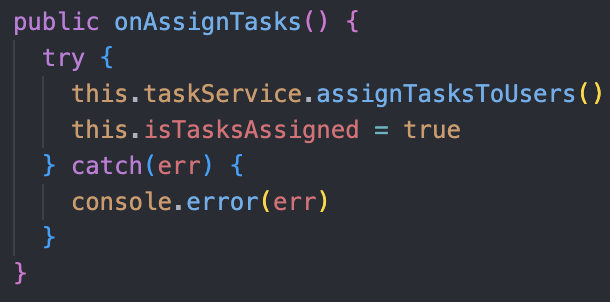
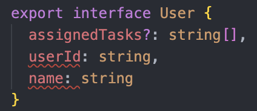
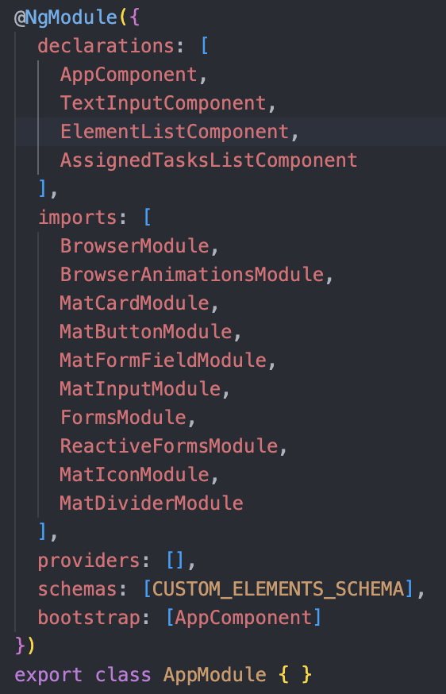
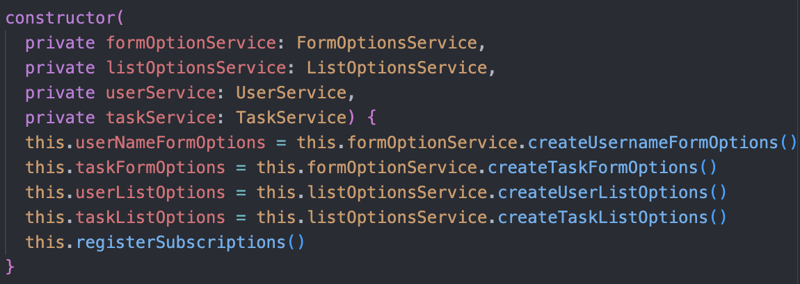

# Reflektion

## Kapitel 2

**Class names** - Klasser ska vara substantiv är något som jag använt mig av för att se till att mina klasser kan instanseras till användbara objekt. **Method names** Metodnamnen är i enlighet med boken verb som beskriver en handling. Gärna korta metodnamn. I de fall jag kunnat har jag även använd get/set och is. Ibland har jag även använt t.ex. "shouldDisableClearButton" vilket säkert kan ersättas med "is..." och jag skulle gärna se att någon annan kom med sådana förslag i min kod då jag inte kommer på något riktigt bra själv:

## Kap 3

**Small!** och **Do one thing** är något som jag försöker att använda så mycket jag kan. Det kan nästan kännas "fjantigt" ibland men koden blir ju också mer lätt-testad om den bara göra en sak och är liten. Jag försöker också att följa **Function Arguments** så mycket jag kan genom att se till att funktioner har som mest ett argument (_monadic_) eller helst inga alls (_niladic_). Här ser jag att funktionen "constructUser" kanske är på en annan abstraktionsnivå än de andra funktionerna som snarare hanterar olika "events" som förekommer, t.ex. borttag av uppgift, tillkomst av en uppgift eller en användare o.s.v. Detta hade kunnats delats in i en annan eller ny klass för att undvika att klassen tappar _cohesion_ enligt kapitel 10 **Maintaining cohesion Results in Many Small Classes**

## Kapitel 4

Jag har ju helt undvikit kommentarer förutom jsdoc för en funktion som kastar fel vidare från underliggande funktioner. Anledningen till att jag inte har några kommentarer är för att jag använder mig av **Explain Yourself in Code** och låter koden "tala för sig självt" kring vad den gör. Jag har försökt att följa **Redundant Comments** för att undvika onödig kommentarer och detta blir också enklare ju mindre funktionerna blir. Ju mindre en (tänk _Do one thing_) funktion är, desto mer överflödig skulle kommentarerna bli. Jag har inte heller kommenterat metoderna i min app enligt **Javadocs in Nonpublic Code** då det bara skulle vara distraherande.

## Kapitel 5

Formattering är viktigt för att se till att läsbarheten är hög. Enligt boken sätter jag instansvariabler högst upp i klassen (**Instance Variables**). Funktioner som anropar varandra försöker jag har så nära varandra som möjligt enligt **Dependent Functions** för att få ett sånt bra "flyt" som möjligt läsbarheten. Ibland har jag säkert missat detta och jag misstänker att det finns bra stöd i IDE's idag för att rätta till sådana saker. Något för mig som känns som ett riktigt konstverk är när man verkligen får till **The Newspaper Metaphor** där koden skrivs på ett sådant sätt att det är som att läsa en berättelse, topp till slut.

## Kapitel 6

**The Law of Demeter** tror jag att jag har lyckats med då jag inte anropar, eller ens kan anropa några funktioner på ett objekt som returneras från en metod någonstans. Jag försöker ju med att dölja ett objekts interna datastruktur genom att exponera metoder som manipulerer arrayen (t.ex. addUser). Däremot exponerar jag ju hela arrayen med Users via metoden "getUsers" vilket kanske inte är så bra då det ger anroparen möjlighet att göra vad de vill med den. Skulle vara intressant att få input på hur jag bör göra istället enligt det boken tar upp angående **Data Abstraction**!

## Kapitel 7

**Don't Return Null**, returnerar inte null från någon metod för att helt enkelt slippa göra så många null-checkar. Innan denna laboration började returnerade jag felaktigt null från min modul vilket jag fick ändra till att kasta fel istället. Jag har en try-catch-sats som fångar upp när min modul kastar fel. Idag gör jag inget annat än att logga ut felet men en bra påbyggnad i framtiden vore att visa ett felmeddelade för användaren och vad den kan göra åt det.

## Kapitel 8

**Using Third-party Code** "Wrappar" in min modul i en egen klass så att ändringar i modulen endast medför ändringar i denna klass utan att jag behöver ändra överallt. Hade säkert gått att injicera den via Angulars inbyggda IoC-ramverk men jag har inte utforskat det spåret just nu. Jag använder mig också av några tredjeparts-bibliotek som t.ex. rxjs. Det går säkert att kapsla in på något sätt men jag känner att tidsåtgången för detta skulle överstiga nivån för detta projekt. Även om det skulle vara imycket ntressant att se! Tredje-parts-beroendet för 'uuid' hade säkert varit lätt att kapsla in nu nör jag tänker efter. **Using code that does not exist yet** är något jag har kunnat använda genom att använda just ett interface för att definiera hur användare ska se ut i min applikation. I Typescript brukat "interface" användas snarare för att definiera en datastruktur än ett beteende som är det vanliga när vi i objekt-orienterad programmering pratar om interface.

## Kapitel 9

I mitt projekt har jag inga enhetstester men jag tror att min kod hade varit lätt att testa då många funktioner rätt hyffsat gör en sak. Då hade _Single concept per test_ blivit lättare tror jag då mängden utfall från en funktion att testa helt enkelt blir mindre. Hade jag skrivit tester hade jag försökt att hålla dessa "clean" då jag vet av erfarenhet, och som boken nämner, att väldigt mycket om tester handlar om läsbarhet. **Clean Tests**, det ska vara lätt att se vad ett test gör och varför!

## Kapitel 10

**Single Responsibility Principle** använder jag för att se till att en klass bara ska göra en sak. Jag tycker att detta i praktiken kan svårt att åstadkomma. Jag försöker då ta hjälp av det som också nämns under **Classes should be small!**, går klasserna att minska ner kommer de fömodligen också att endast göra en sak. Bilden nedan är exempel från min kod utifrån detta då jag tänker att klassen "TasksService" enda ansvarsområde är att hantera tasks men även att kommunicera ut när något förändras (vilket iof skulle kunna vara en egen klass också):

## Kapitel 11

**Dependency Injection** använder jag mig väldigt mycket av då en av Angular-ramverkets huvuduppgifter är att hjälpa en med detta. Jag tror dessutom att detta sker enligt det som boken beskriver som _True dependency injection_, alltså att klassen sjölv inte behöver lösa sina beroenden utan att detta sker helt passivt när klassen instantieras. Detta blir mycket lämpligt då jag använder mig av servicar (egentligen bara klasser som injiceras) för att transportera data mellan klasser. När det gäller **Separate Constructing a System from Using it** så hade jag nog kunnat gjort min app.component.ts mindre genom att dela upp den i fler klasser. Det känns som att denna klass borde vara lite mer ansvarig för just "setup" och inte så mycket av vad som "händer när appen körs".

En variabel som skickas in i en konstruktor med private-modifiern injiceras enligt Angulars IoC-ramverk

## Övrigt

Har med ett kapitel övrigt kring andra reflektioner jag gjort generellt och med tanke på andra kapitel utöver 2-11.

Publishers med hjälp av observables följer mönstret för subscribe/publish vilket känns som att det borde bidra till Clean Code då det är ett välanvänt och allmänt känt mönster. Jag hoppas det bidrar till Clean Code i alla fall!

Jag har en generell webbkomponent som hanterar när text skrivs in och skickar denna text vidare till dess parent-komponent. Jag skickar in de attribut som konfigurerar hur komponenten ska fungera via JSON. På detta sätt jag då styra formuläret från min parent-komponent och kan därför få textkomponenten att fungera lite olika beroende på vad jag skickar in för attribut. T.ex. olika minsta-längd på text samt dess felmeddelanden. Detta JSON-objekt kommer dessutom från en service (egentligen en vanlig klass) som injectas in i min parentkomponent. Servicens enda ansvar är att leverera dessa objekt Det går att abstrahera bort detta ännu mer och dessutom skicka in olika validatorer om jag vill det. När jag gör på detta sätt kommer formulären att fungera även om detta objekt är undefined. Formuläret skulle ju dock inte vara så användbart utan placeholders och validatorer men appen kraschar inte vilket gör att det känns som att jag åstadkommit en relativt lös koppling. Jag märker dock att ju mer jag abstraherar ut från min komponent desto mer svårbegriplig blir den. Här försöker jag hitta en avvägning då den används på endast två ställen. Skulle jag använda den mer kanske man får fundera över hur mycket den ska gå att styra "utifrån".

Jag följer inte alltid mönstret med att förkorta metodsignaturen med tanke till argumentets typ, ex. borde addUser(user: User) kunna skrivas add(user: User) för att bli mer verbalt. Anledningen till detta är väl egentlig slarv i koden om jag ska vara ärlig.

public readonly userAdded$ = this.userSource.asObservable(); hjälper mig att slippa manipulation av publika attribut. Detta går även att förbättra om man dyker önnu djupare in i Rxjs. Ska jag vara helt ärlig vore det mycket bra om boken uppdaterades med Clean Code-exempel på hur detta kan skrivas med hjälp av reaktiv kodning i mycket vanliga ramverk som ex. Rxjs och RxJava.

Hade gjort en tankevurpa i min modul och lagt till en validator som kollar att användarid måste var ett nummer, här tänkte jag såklart kunna använda en textsträng i form av ett uuid så här fick jag ändra i själva modulen.

Skulle vilja veta mer hur man ska tänka kring att ha publika attribut i en klass än att ha en metod eller getter som bara refererar till ett privat attribut. Mats Loock pratade om "privacy leak" en gång när jag pratade med honon men har inte hittat något i kursboken om detta. Dock något jag skulle vilja veta mer om!

Blandad logik som sker både i html och i programkod. Vad är bäst? Tycker inte att boken tar upp detta vilket vore bra i och med ramverk där sådana kombinationer är vanliga. Hur åstadkommer man Clean Code i ex. React, Angular eller Vue?

## Till Examinator

Modulen och test-appen finns på [Gitlab](https://github.com/matthihat/randomify)
